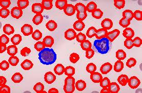
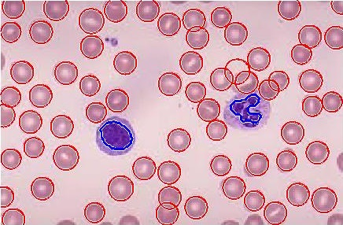
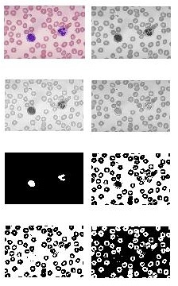

<h1 align = "center"> Blood Cell Counter </h1>
<h2 align = "center"> A RBC, WBC counter implemented in Python and Matlab </h2>

<h5> Project Description </h5>

This blood cell counter uses image processing techniques to segment the RBC's and WBC's in a blood image. In Python, OpenCV framework is used to perform image processing. Following are the steps taken to perform RBC and WBC Segmentation:

<h5> Prerequisites </h5>

Languages: Python 3, MATLAB

Python Libraries: Numpy, OpenCV
